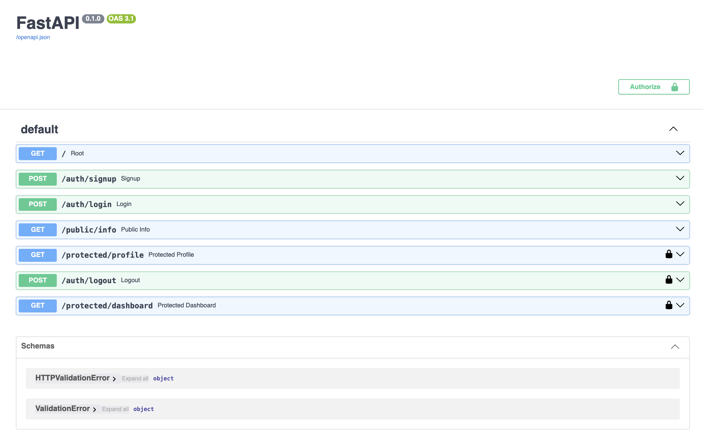

# Secure FastAPI Backend with Supabase Auth

A secure REST API built with FastAPI and Supabase Auth, that can handle user registration, token-verified sessions, protected routes and has interactive documentation

## Features
- **User Authentication**: Secure sign up, login and log out
- **Token Verification**: Reusable FastAPI dependency that enforces token validation
- **Protected Endpoints**: Secure routes (`/protected/profile`, `/protected/dashboard`) that will rejected missing or invalid tokens
- **Interactive Documentation**: Fully integrated Swagger UI with Bearer token authorization 

---

## Environment Variables
Create a `.env` file in the root directory copying the example in `.env.example`:

```env
SUPABASE_URL=your_supabase_project_url
SUPABASE_KEY=your_supabase_anon_key
PORT=your_port_number
```

## How to Run

1. Install dependencies:

```pip install fastapi uvicorn supabase python-dotenv```

2. Start the development server:

```uvicorn main:app --reload```

3. Open browser to `http://localhost:8000/docs` to test the API.


## API Reference Table 

| Endpoint | Method | Purpose | Auth Required? |
| :--- | :--- | :--- | :--- |
| `/` | GET | Root health check | No |
| `/public/info` | GET | Read public lobby data | No |
| `/auth/signup` | POST | Create a new user account | No |
| `/auth/login` | POST | Authenticate and return JWT | No |
| `/auth/logout` | POST | End user session (204 No Content) | Yes (`Bearer <token>`) |
| `/protected/profile` | GET | Read private user profile data | Yes (`Bearer <token>`) |
| `/protected/dashboard` | GET | Access protected user dashboard | Yes (`Bearer <token>`) |

---

## Swagger Screenshot
